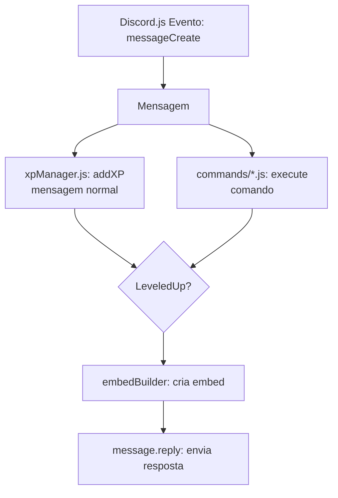

# WBK Bot

Um bot para Discord focado em **gamificação e engajamento de membros**, com sistema de XP, ranking, comandos de interação e mensagens automáticas de boas-vindas. Criado com Node.js e Discord.js, o WBK Bot é modular e escalável, ideal para comunidades que querem incentivar participação ativa.

---

## 🔹 Funcionalidades principais

* Sistema de **XP** por atividade no servidor
* **Ranking** de membros mais ativos
* Comandos básicos: `$help`, `$ping`, `$xp`, `$ranking`
* Mensagens automáticas de boas-vindas e eventos
* Estrutura modular para fácil expansão

---

## 🔹 Tecnologias usadas

* [Node.js](https://nodejs.org/)
* [Discord.js v15](https://discord.js.org)
* Arquivos JSON como banco local (`database/xp.json`)
* Modularização por **comandos**, **eventos** e **utilitários**

---

## 🔹 Estrutura do projeto

```text
wbk-bot/
├── assets/             # Imagens e arquivos do bot
├── commands/           # Comandos do bot (XP, ranking, help, ping, etc.)
├── config/             # Configurações do bot (prefixo, roles)
├── database/           # Banco de dados local (XP, schemas)
├── events/             # Eventos do Discord (messageCreate, guildMemberAdd, etc.)
├── utils/              # Funções utilitárias (XP, embeds, logger)
├── docs/               # Documentação detalhada dos módulos
├── index.js            # Arquivo principal do bot
├── package.json
└── README.md
```

> Para documentação detalhada de cada módulo e explicações sobre a estrutura, veja [docs/MODULES.md](./docs/MODULES.md)

---

## 🔹 Como usar

1. Clone o projeto:

```bash
git clone https://github.com/Zer0G0ld/wbk-bot.git
```

2. Instale as dependências:

```bash
npm install
```

3. Configure seu `.env`:

> Exemplo disponível em `.env.example`

```
DISCORD_TOKEN=SEU_TOKEN
PREFIX=$
```

4. Inicie o bot:

```bash
node index.js
```

ou se preferir 

```bash
npm start
```

---

## 🔹 Estrutura de modularização

O WBK Bot é organizado em:

* **Commands**: Cada comando (`xp.js`, `ranking.js`, `help.js`, etc.) é isolado, facilitando a adição de novos comandos.
* **Events**: Captura eventos do Discord, como mensagens, entrada e saída de membros, etc.
* **Utils**: Funções auxiliares como `xpManager.js` (XP e nível), `embedBuilder.js` (embeds padronizados), `logger.js`.
* **Database**: Armazena dados persistentes do servidor localmente em JSON, permitindo backup e manipulação fácil.

---

## Diagramas



```text
                  ┌───────────────┐
                  │  Discord.js   │
                  │  Evento:      │
                  │ messageCreate │
                  └───────┬───────┘
                          │
         ┌────────────────┴───────────────┐
         │                                │
   Mensagem normal                   Comando detectado
         │                                │
 ┌───────┴────────┐               ┌───────┴────────┐
 │ xpManager.js   │               │ commands/*.js  │
 │ addXP()        │               │ execute()      │
 │ getLevel()     │               │ getXP()/utils  │
 └───────┬────────┘               └───────┬────────┘
         │                                │
         │                                │
         └─────────┐            ┌─────────┘
                   │            │
               Verifica leveledUp
                   │
             ┌─────┴─────┐
             │ embedBuilder│
             │ Cria embed │
             └─────┬─────┘
                   │
             ┌─────┴─────┐
             │message.reply│
             │  Envia     │
             └────────────┘
```

---

## 🔹 Contribuição

Contribuições são bem-vindas!
Basta criar uma branch para sua feature ou correção, commitar e abrir um Pull Request.

---

## 🔹 Licença

[GPL-3.0 License](LICENSE) © WBK Bot
